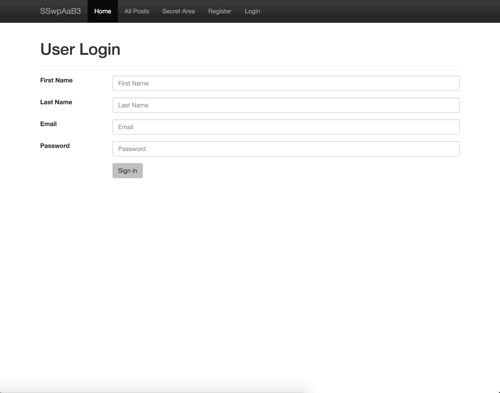
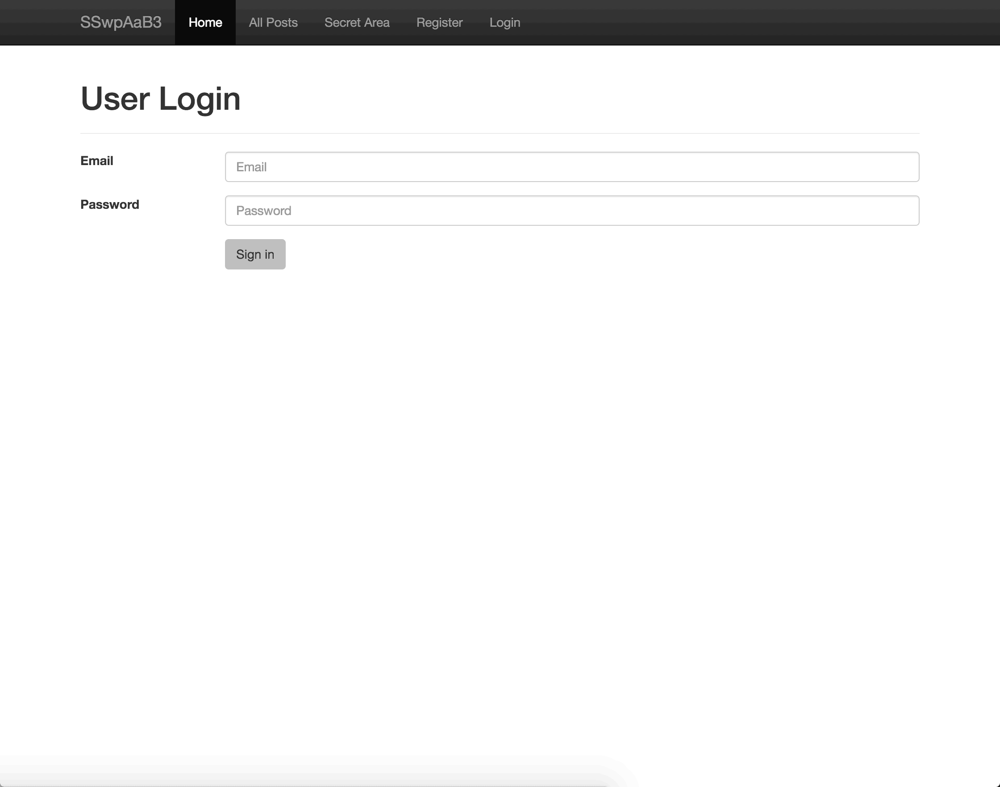
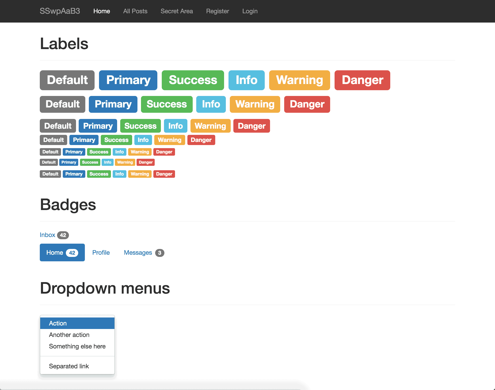

### Purpose
The Sinatra skeleton with prebuilt authentication and custom CSS for styling:

1. Provides a foundation for creating a new Sinatra application.
2. Migration and model exists for User
3. Ready seed file and currently generates 10 fake users.
4. Passwords are encrypted using Bcrypt.
5. All passwords are set to "password" for testing purposes.
6. User must provide: first name, last name, email address, and password while registering
7. User logs in with email address and password
8. Upon successful login, user is redirected to profile page
9. This is a template showcasing the optional theme stylesheet included in Bootstrap.
10. Use it as a starting point to create something more unique by building on or modifying it.

Feel free to make any modifications...

### Quickstart

1.  `bundle install`
2.  `shotgun config.ru`

As needed, create models & migrations with the `rake` tasks:

```
rake generate:migration  # Create an empty migration in db/migrate, e.g., rake generate:migration NAME=create_tasks
rake generate:model      # Create an empty model in app/models, e.g., rake generate:model NAME=User
```

## Screenshots: 

#### Signup:


#### Login:


#### Style:



